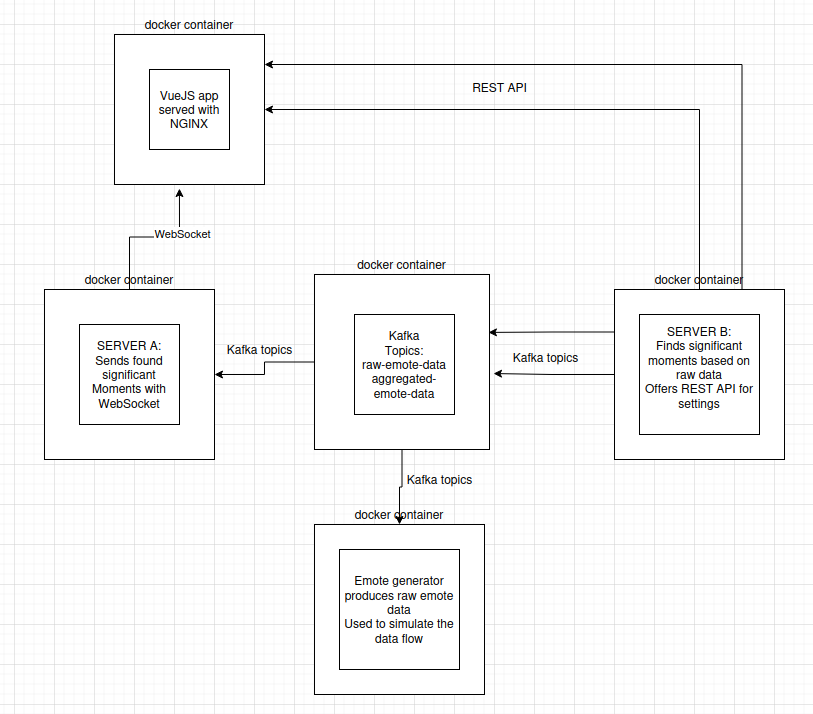

# Documentation

## Contributors
Lu Jie (jie.lu@tuni.fi), responsobilities: server-a, front-end, emote-gen, docker set-up. |
Pavel Kudelko (pavel.kudelko@tuni.fi), responsobilities: server-b, front-end, docker, documentation.

## Architecture
Technologies used
- Server b build on Nodejs with Express
- Server a built on Nodejs with Express
- frontend is hosted on NGinx, built with vue (we don't like react) using typescript and tailwind
- Application is conteinerized with Docker
- Kafka message brocker used for handling raw emote data as well as processed emote data as significant moments

### Architecture diagram


## Patterns Applied
- Client-Server Architecture: frontend client communicates with backend servers
- Modular Component: frontend and backed are using modular development
- RESTful API: Backend exposes endpoints for frontend communication
- docker ....

## Fronted Component
- Video Player Component
Purpose: Embeds and displays YouTube videos within the application
Implementation: Custom Vue component with responsive design and a fixed 9:16 ratio with videojs vue package
- Emoji Display Effect Component
Purpose: imports emojis and timestamp JSON messages from backend and displays respective effects
Implementation:
- EmojiRainStormEffect vue component imports emoji-blast npm pacakge
- SignificantMomentsDisplay vue component displays significant emojis
- EmojiDisplayControls vue component passes user selected emoji threshold to backend server_b with PUT Api communication
- CurrentMomentDisplay vue component loads current emojis received from backend server_a
- EmojiAllowedControls vue component that provides functionality for dissallowing partcicular emojis from significant moments powered with server-b API
- EmojuIntervalControls vue componets provied functinality to change sampling interval for significant moments powered with server-b API

## Backend
### Server a
- ***Purpose:*** Receives emote data by subscribing to emoji topics from kafka, emits JSON parsed data to frontend with websocket
    - raw-emote-data: Provides real-time emote usage data.
    - aggregated-emote-data: Represents significant or aggregated emote events.
- ***Implementation***:
- index.js:
    - Sets up an Express server and HTTP server.
    - Initializes WebSocket support using socket.io.
    - Starts the Kafka consumer and handles connection errors gracefully.
    - Listens on ports to allow external access from the host or other containers.
- kafka.js:
    - Uses kafkajs to connect to the Kafka broker (kafka:9092) with retry configurations.
    - Subscribes to raw-emote-data and aggregated-emote-data topics.
    - Parses the Kafka messages as JSON and emits them to appropriate WebSocket channels:
    - Emits current-moment for raw emote data.
    - Emits significant-moment for aggregated/emphasized emote data.
    - Handles errors during message processing to avoid crashing the consumer loop.
    websocket.js:
    - Initializes the WebSocket server with CORS support for various development URLs.
    - Listens for client connections and disconnections.
    - Provides a channel for broadcasting emote updates received from Kafka.

### Server b
- Purpose: Aggregates raw emote data from kafka, generates significant moments and sends to kafka topic.
        Provides RESTfull API for user settings (threshold, interval, allowedEmotes).
- Implementation:
Server b componets:

```
server-b/
├── apitest.http                 # HTTP file for testing API routes (e.g., in VSCode or Postman)
├── config/
│   └── settings.js             # Stores and provides access to in-memory settings
├── controllers/
│   └── settingsController.js   # Handles logic for settings routes (GET/PUT handlers)
├── Dockerfile                   # Docker configuration to containerize the service
├── index.js                     # Main server entry point
├── middleware/
│   └── validators.js           # Input validators for settings update routes
├── package.json                 # Project dependencies and scripts
├── package-lock.json
├── README.md                    # Project documentation
├── routes/
│   └── settingsRoutes.js       # API route definitions for settings endpoints
└── services/
    └── kafkaService.js         # Starts and handles Kafka consumer logic
```

- API endpoints:
GET	/settings/interval	Get current interval value
PUT	/settings/interval	Update interval (validated)
GET	/settings/threshold	Get current threshold value
PUT	/settings/threshold	Update threshold (0–100 → 0–1)
GET	/settings/allowed-emotes	Get allowed emotes list
PUT	/settings/allowed-emotes	Update allowed emotes (validated)

- Validation Logic

Implemented in middleware/validators.js. Ensures:
- interval is a positive number.
- threshold is in 0–100 range before conversion.
- allowedEmotes is a valid array of strings.

# How to run

- clone repo:
```
git clone https://course-gitlab.tuni.fi/compcs510-spring2025/supersonic.git
```
- launch docker
```
cd supersonic/
docker-compose up --build
```